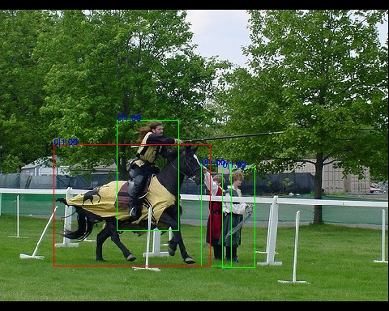
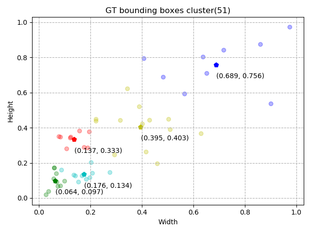
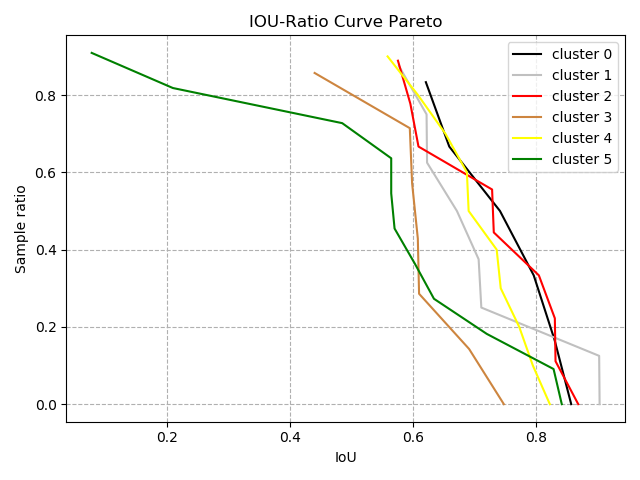

# YOLOv3-tensorflow

By 郑煜伟

基于tf.keras，实现YOLOv3模型。

本项目延伸自[本人的YOLO v2实现](https://github.com/zheng-yuwei/YOLOv2-tensorflow)。

## 本项目相比其他YOLO v3项目的特色

与TensorFlow版本的YOLO v3项目相比，**最大程度遵从原始论文、原始Darknet框架的实现&**
（可以说解决了逻辑bug吧，具体可查看`1_learning_note/implementation_process.ipynb`）；

与原版Darknet、Caffe实现相比，train-from-scratch的预测框校正功能可根据实际情况进行开启/关闭；

与所有YOLO v3项目相比：
1. 使用tf.data.Dataset读取数据，tf.keras构造模型，简单易懂，同时易于多GPU训练、模型转换等操作；
2. 全中文详细代码注释，算法理解等说明。

需要注意的：
- YOLOv3的head用了2（head /32)、7（head /16）、7（head /8）层卷积，与我的实现有差异；
若想更改，可在`yolov3/yolov3_detector.py`文件中修改各个head函数；

## 如何使用

取coco数据集中的20张图片做训练，测试效果如下，更多结果可查看`dataset/test_result*`。



- 蓝色框源于head /8，由于该head stride小，特征图分辨率高，所以设置小anchor，聚焦于检测小物体；
- 绿色框源于head /16，由于该head stride适中，特征图分辨率适中，所以设置中等anchor，聚焦于检测中等物体；
- 红色框源于head /32，由于该head stride大，特征图分辨率小，所以设置大anchor，聚焦于检测大物体；

具体实验调参过程中，可以参考测试绘制的框的情况（结合训练过程中loss变化），调整参数。


### 快速上手

1. 制作数据集`label.txt`，一行为`image_path x0 y0 w0 h0 cls0 x1 y1 x1 h1 cls1 ...`，
其中`xywh`为待检测目标的bounding box中心点坐标和宽高相对于原图的比例（归一化了），`cls`为类别；
1. 实际用自己的数据训练时，可能需要执行以下`utils/check_label_file.py`，确保标签文件中的图片真实可用；
1. 修改并运行`utils/anchors/kmeans_anchors.py`，聚类预定义anchors；
1. run.py同目录下新建 `logs`文件夹，存放日志文件；训练完毕会出现`models`文件夹，存放模型；
1. 查看`configs.py`并进行修改，此为参数配置文件；
1. 执行`python run.py`，会根据配置文件`configs.py`进行训练/测试/模型转换等（需要注意我设置了随机种子）。





以上的IOU-Ratio曲线需要**从右往左看**，表示随着与聚类中心IOU越小，类内label框的占比比例。

### 学习掌握

1. 先看`README.md`;
2. 再看`1_learning_note`下的note；
3. 看`multi_label`下的`trainer.py`里的`__init__`函数，把整体模型串起来；
4. 看`run.py`文件，结合着看`configs.py`。

## 目录结构

- `A_learning_notes`: README后，**先查看本部分**了解本项目大致结构；
- `backbone`: 模型的骨干网络脚本；
- `dataset`: 数据集构造脚本；
    - `dataset_util.py`: 使用tf.image API进行图像数据增强，然后用tf.data进行数据集构建；
    - `file_util.py`: 以txt标签文件的形式，构造tf.data数据集用于训练；
- `images`: 项目图片；
- `logs`: 存放训练过程中的日志文件和tensorboard文件（当前可能不存在）；
- `models`: 存放训练好的模型文件（当前可能不存在）；
- `utils`: 一些工具脚本；
    - `anchors`: 通过k-means聚类计算得到预定义anchors；
    - `board_callback.py`：自定义TensorBoard；
    - `check_label_file.py`: 在训练前检查训练集，确保标签文件中的图片真实可用；
    - `logger.py`：构造文件和控制台日志句柄；
    - `logger_callback.py`: 日志打印的keras回调函数；
    - `radam.py`: RAdam算法的tf.keras优化器实现；
- `yolov3`: yolov3模型构建脚本；
    - `label_decoder.py`：将标签解码为3个head的标签；
    - `train.py`: 模型训练接口，集成模型构建/编译/训练/debug/预测、数据集构建等功能；
    - `yolov3_decoder.py`: 对YOLO v3模型的预测输出进行解码；
    - `yolov3_detector.py`: 构造YOLO v3检测器模型；
    - `yolov3_loss.py`: YOLO v3的损失函数；
    - `yolov3_post_process.py`：YOLO v3后处理，预测和测试的时候用。
- `configs.py`: 配置文件；
- `run.py`: 启动脚本；


## 代码库特别说明

### 标签文件格式说明

标签文件格式内容为：
```
image_path x0 y0 w0 h0 cls0 ...
```
其中，`image_path`是图片相对路径，会拼接上`configs.py`中的`FLAGS.train_set_dir`（测试的话则是`FLAGS.test_set_dir`）；
`x0 y0 w0 h0`是归一化后的待检测物品中心点坐标、宽高，归一化也就是 实际尺寸/图片尺寸；
`cls0`是图片类别，即使是单类别且不计算类别损失，该位也必须存在（可以任意值）。
前者是多类别的目标检测，后者主要是单类别的目标检测。
后续省略号表示多个待检测对象的标签`x0 y0 w0 h0 cls0`。

## 算法说明

[YOLOv3](https://zheng-yuwei.github.io/2018/12/15/5_YOLOv3/)

## MixNet的理解

MixNet是Google在**轻量级网络结构**上探索的又一成果。

2019-05 Google将NAS用到了轻量级网络结构的搜索上，得到MnasNet，也就是MobileNet v3
（[Searching for MobileNetV3](https://arxiv.org/abs/1905.02244?context=cs))。
论文中的启示可能有：
1. 沿用了MobileNet v2的基本结构块：x6通道数的1x1卷积，步长为2的3x3 depthwise卷积，/2通道数的1x1线性卷积；
1. 基于squeeze and excitation结构的轻量级注意力模型；
1. 使用 h-swish激活函数（hard swish）：(x * ReLU6(x+3)) / 6；
1. 手工微调网络开端和结尾这两个开销比较大的部分。

2019-07 针对kernel size的影响进行了系统性研究，观察 multiple kernel sizes 的融合可以带来精度和效率上的提升，
也就是 mixed depthwise convolution (MixConv,
论文 [MixConv: Mixed Depthwise Convolutional Kernels](https://arxiv.org/abs/1907.09595))。
然后将其集成到AutoML的搜索空间中，最终得到MixNets轻量网络结构体系（论文结果优于MobileNet v3）。
启示可能包括（沿用MobileNet v2/v3的基础模块结构）：
1. 加上了分组卷积的思维：在前后两个1x1卷积中进行了分组操作；
1. 将中间的3x3卷积模块替换为MixConv：有`[16, 8, 4, 4]`比例的4组`[3, 5, 7, 9]`卷积核尺寸；
1. 若卷积核太大，计算量不太可承受，可考虑使用dilated convolution。

我在`backbone`中实现的MixNet并不是论文中的网络结构，而是使用了MixConv不同卷积核尺寸的思想构造的网络。

## TODO
- [ ] 多尺度输入;
- [ ] mixup;
- [x] focal loss;
- [ ] GHM损失函数;
- [ ] GIOU;
- [x] TIOU-Recall;
- [ ] Guassian YOLO;
- [ ] 模型测试，计算mAP；

